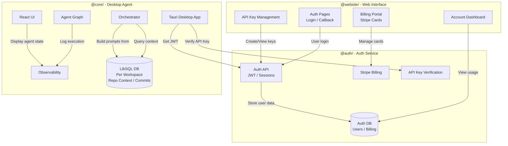
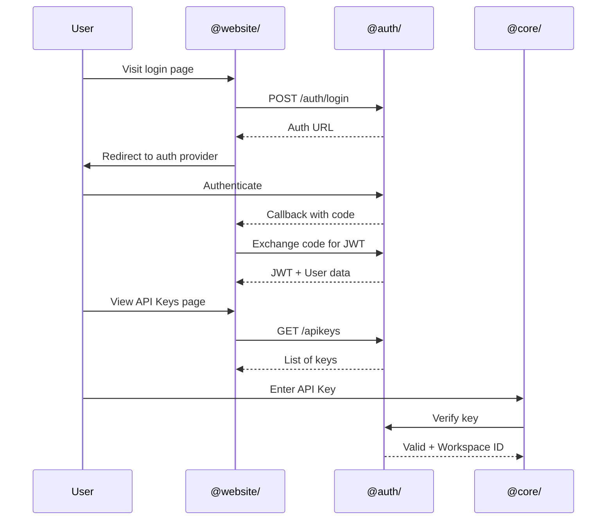
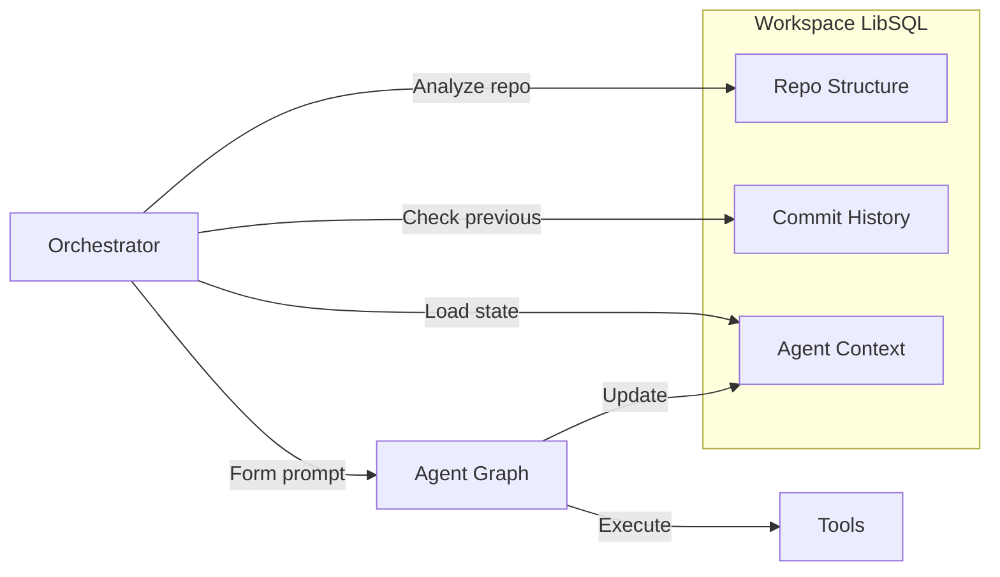
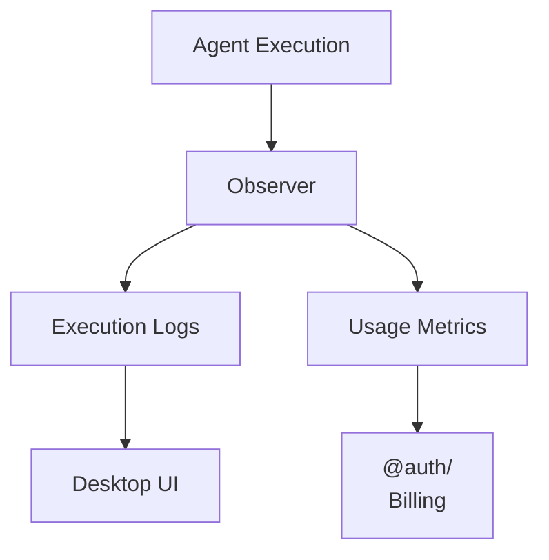

# the-eisen-core

Agentic desktop platform with local context awareness and intelligent orchestration.

## Architecture



## Package Roles

| Package | Responsibility |
|---------|---------------|
| **@website/** | User-facing web interface for auth, Stripe billing, API key management |
| **@auth/** | Backend auth service: user authentication, billing processing, API key verification |
| **@core/** | Desktop agent layer: orchestrator, UI, agent graph, observability, local LibSQL per workspace |

## How It Works

### Auth Flow



### Context-Aware Agents



### Observability



## Key Features

**Local Context**: Each workspace has its own LibSQL database storing repo structure, commit history, and agent state. Orchestrators query this to form better prompts.

**Smart Orchestration**: Agents coordinate without overlap by checking workspace state in local DB.

**Observability**: Full visibility into agent decisions, tool calls, and execution flow.

**API Key Verification**: Core verifies keys against @auth/ service before executing agents.

## Quick Start

```bash
# Start auth backend
cd auth && bun run dev

# Start web frontend
cd website && bun run dev

# Run desktop app
cd core/app && bun run tauri dev
```

## File Structure

```
auth/                      # @auth/ - Auth & billing service
├── src/routes/
│   ├── auth.ts           # Login/callback
│   ├── apikeys.ts        # Key management
│   ├── billing.ts        # Stripe integration
│   └── workspace.ts      # Workspace data
└── src/db/               # Auth database

website/                   # @website/ - Web interface
├── src/app/
│   ├── login/            # Auth pages
│   ├── (protected)/
│   │   ├── account/
│   │   │   ├── api-keys/   # Key management UI
│   │   │   └── billing/    # Stripe billing UI
│   │   └── usage/          # Usage dashboard
│   └── auth/callback/    # OAuth callback

 core/                     # @core/ - Desktop agent
 ├── app/
 │   ├── src-tauri/        # Rust backend
 │   │   ├── main.rs
 │   │   └── lib.rs
 │   └── src/ui/           # React frontend
 ├── core/src/
 │   ├── orchestrator.rs   # Agent coordination
 │   ├── session_registry.rs
 │   └── tracker.rs        # Context tracking
 └── crates/eisen-napi/    # Node bindings
```

## Data Flow

1. User authenticates via @website/ → @auth/ creates session
2. User creates API key on @website/ → stored in @auth/
3. User enters key in @core/ → verified with @auth/
4. @core/ loads workspace from local LibSQL
5. Orchestrator queries repo context from LibSQL to build prompts
6. Agent executes, logs to observer, updates context in LibSQL
